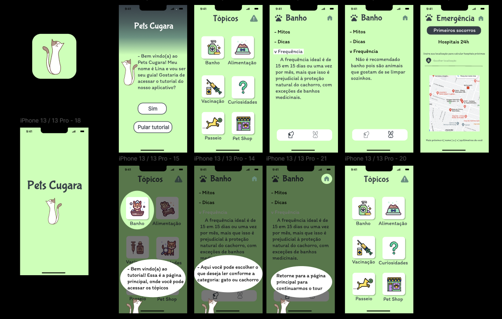

# Pets Cugara 🐶🐾
  🐾  Após pesquisar sobre as dificuldades de donos de pets e ONGs de animais, percebemos que um grande problema é a desinformação. Sabendo disso, nosso aplicativo possui como objetivo ajudar os donos de animais com as dificuldades diárias e informar as necessidades dos pets, melhorando assim a qualidade de vida deles.  
  🐾  No aplicativo é possível acompanhar diversos tópicos que fazem parte do dia-a-dia do animalzinho (com tutoriais, dicas e informações), e dentro de cada tópico há subtópicos para facilitar a leitura e velocidade em encontrar informações do usuário. Além disso, em casos de emergências, há um tópico para primeiros socorros e uma parte reservada para mostrar os hospitais 24h de Fortaleza, onde o usuário vai poder escolher, ver as informações do hospital e acompanhar elas por um mapa.

## Telas reais:

  
  
  
  

  

## Protótipo Figma:

    

 

***

  

